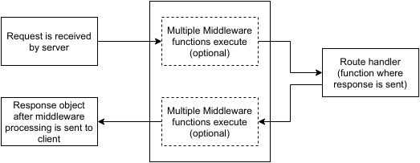

# Express Code-Along Workshop 💻


The workshop is composed of a number of steps with source files included in the individual folders. Before we start, let's go through some information about what Express is and why we use it.


## Workshop tasks
Let's code along the solutions to the following tasks.

1. **Hello world**
    - Task
      - Setup an Express server serving `Hello world` on port 3000
    - Notes
      - Go to Chrome Dev Tools -> Network; and check if the status code is `200` and if the content type is `text/html`
      - Go to Chrome Dev Tools -> Elements; and find `Hello world` in the DOM tree

1. **Hello html**
    - Task
      - Serve the following html
      ```html
      <h1>Hello world</h1><p>Cool</p>
      ```
    - Notes
      - Go to Chrome Dev Tools -> Elements; and check the response in the DOM tree

1. **Hello json**
    - Task
      - Serve the following object as json
      ```js
      { community: 'founders & coders' }
      ```
    - Notes
      - Go to Chrome Dev Tools -> Network; and check if the content type is `application/json`. You may need to hard reload chrome.

1. **Routes to cities**
    - Task
      - Serve `Hello [city name]` (e.g. `Hello London`) on the `/london`, `/nazareth`, `/gaza` paths

1. **One route to cities**
    - Task
      - Serve `Hello [city name]` (e.g. `Hello London`) on the `/london`, `/nazareth`, `/gaza` paths. Use only one route handler to handle the requests.

1. **new-york newyork**
    - Task
      - Serve `Hello New York` on the `/new-york`, `/newyork` paths. Use only one route handler to handle the requests.

1. **My logger middleware**
    - Task
      - Add a logging middleware that logs millisecond timestamp (`Date.now()`) **before** any request to our server is handled.
      - Add a logging middleware that logs millisecond timestamp (`Date.now()`) **after** every request to our server.
      
    - Notes
      - Middleware and routing functions are called in the order that they are declared. For some middleware the order is important (for example if session middleware depends on cookie middleware, then the cookie handler must be added first). It is almost always the case that middleware is called before setting routes, or your route handlers will not have access to functionality added by your middleware.
      - The **only** difference between a middleware function and a route handler callback is that middleware functions have a **third argument `next`**, which middleware functions are expected to call if they do not complete the request cycle

1. **Morgan logger middleware**
    - Task
      - Add a `morgan` middleware to log standard Apache combined server log output
      - Save logs in the `access.log` file in the `logs-demo` folder
      - Compare the server logs by trying two different browsers

1. **Static files**
    - Task
      - Serve static files from the `public` folder

1. **Post form data**
    - Task
      - Access form data on the server

1. **Handle errors**
    - Task
      - Serve `page node found` with a status code of 404
      - Serve `internal server error` with a status code of 500, for example when trying to call an undefined function in one of the route handlers

1. **Prepare for production**
    - Tasks
      - Set port number
      - Disable `Powered by express` header' (check headers before and after in Chrome Dev Tools -> Network);
      - Enable compression
      - Let browser know to cache static resources for 30 days.

1. **Split into modules**
    - Tasks
      - Split the app into modules
        1. Create a new starting point: `index.js`
        2. First move routes to the `controllers/index.js` folder
        3. Then seperate routes out into individual files.

        ```
        13-split-into-modules
        ├── public
        └── src
            └── app.js
            └── index.js
            └── controllers
                └── error.js
                └── fruit.js
                └── index.js
        ```


## Tips

- You can run `nodemon` in a quiet mode with: `nodemon app.js -q`


## Resources

- [6 Easy Ways to Speed Up Express](https://stackabuse.com/6-easy-ways-to-speed-up-express/)
